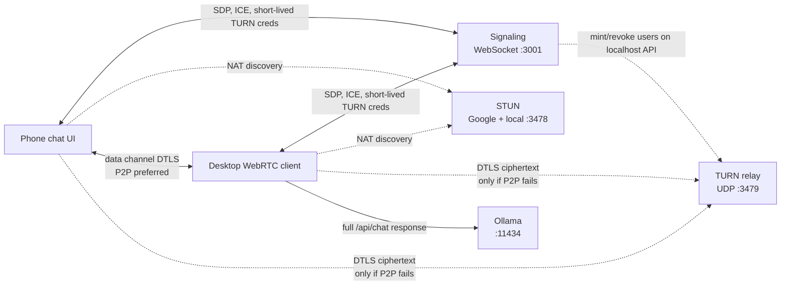
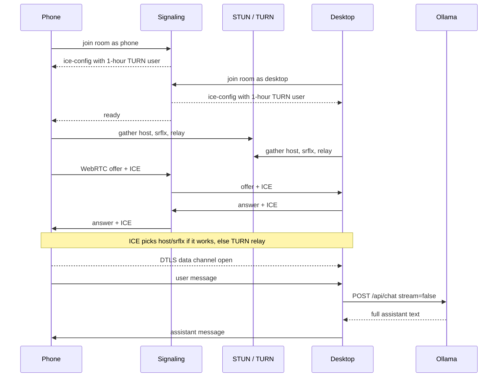

# TunLLM

TunLLM is a WebRTC tunnel from your phone to an Ollama instance running on your desktop. You type on the phone, the desktop talks to the local model, and the full reply comes back over a data channel.

It is a small TypeScript stack: a phone chat UI, a desktop WebRTC client next to Ollama, a signaling server, a STUN server, and a TURN server you can deploy when a direct path is not possible.

## The problem

Ollama is bound to the machine it runs on. Phones cannot hit `localhost:11434` on your desktop, exposing Ollama on the LAN is awkward, and sending prompts through a cloud API defeats the point of a local model.

You want the model to stay on the desktop, and a simple chat UI on the phone, without a public HTTP proxy that can read the chat.

## How it works

The phone and desktop open a WebRTC data channel. ICE tries a **direct (P2P) path first**. If both sides are on the same Wi-Fi, that usually succeeds with host candidates. If NATs block a direct path, ICE falls back to **TURN**, which only forwards packets.

Ollama never leaves the desktop. Chat is encrypted with **DTLS before it hits the network**. TURN is a UDP relay, not a TLS terminator, so the TURN host sees ciphertext and cannot read prompts or replies. Signaling only carries SDP/ICE setup, not the conversation.

The phone never gets a long-lived TURN password. After join, signaling mints a one-hour username/password through TURN's localhost API (`:3480`) and sends that `ice-config` over the WebSocket. The static `TURN_API_SECRET` stays on the servers. The temporary credential still has to reach the browser so ICE can authenticate, then it expires.

Google's public STUN servers are used for address discovery. This repo also keeps a local STUN process. Google does not offer public TURN.



Connection setup, then a chat turn:



The desktop keeps conversation history in memory for that session and sends complete replies, not tokens. If `OLLAMA_MODEL` is unset, it picks the smallest installed chat model and skips embedding/docling models.

After connect, the phone and desktop log the selected ICE types (`host` / `srflx` = P2P, `relay` = TURN).

## Use it

**Needs**

- Node.js 18+
- [pnpm](https://pnpm.io)
- [Ollama](https://ollama.com) running locally, with at least one chat model pulled

**Start**

```bash
pnpm install
ollama serve
pnpm dev
```

`pnpm dev` runs STUN, TURN, signaling, the desktop client, and the Vite phone app together.

Open `http://localhost:5173` on this machine. On a phone, use the Network URL Vite prints (same Wi-Fi), for example `http://192.168.1.73:5173`. The app only needs signaling on that hostname at port `3001`. TURN host and credentials arrive in `ice-config` after join.

Wait until the badge says **Live**, then send a message.

**Pieces you can run alone**

| Command | Process |
|---|---|
| `pnpm stun` | STUN on UDP `3478` |
| `pnpm turn` | TURN on UDP `3479` plus localhost credential API on `3480` |
| `pnpm signaling` | signaling WebSocket on `3001` |
| `pnpm desktop` | desktop client (waits for signaling, then Ollama) |
| `pnpm app` | phone UI |

**Deploy TURN somewhere else**

Run `pnpm turn` on a host both the phone and the desktop can reach (VPS, etc.). Open UDP `3479` and UDP `49152–49251`. Keep the credential API on localhost (or a private network) so only signaling can mint users:

```bash
TURN_EXTERNAL_IP=203.0.113.10 \
TURN_PUBLIC_HOST=203.0.113.10 \
TURN_API_SECRET=change-me \
pnpm turn
```

Point signaling at that API and the same advertised host:

```bash
TURN_API_URL=http://127.0.0.1:3480 \
TURN_API_SECRET=change-me \
TURN_PUBLIC_HOST=203.0.113.10 \
pnpm signaling
```

The phone app does not take TURN passwords. Change `TURN_API_SECRET` before exposing anything.

**Useful env vars**

| Variable | Default | Used by |
|---|---|---|
| `OLLAMA_URL` | `http://127.0.0.1:11434` | desktop |
| `OLLAMA_MODEL` | smallest local chat model | desktop |
| `SIGNALING_URL` | `ws://127.0.0.1:3001/ws` | desktop |
| `ROOM` | `tunllm` | desktop |
| `SIGNALING_PORT` | `3001` | signaling |
| `STUN_PORT` | `3478` | stun + ice-config |
| `TURN_PORT` | `3479` | turn + ice-config |
| `TURN_API_PORT` | `3480` | turn |
| `TURN_API_HOST` | `127.0.0.1` | turn |
| `TURN_API_URL` | `http://127.0.0.1:3480` | signaling |
| `TURN_API_SECRET` | `tunllm-turn-api` | turn + signaling |
| `TURN_REALM` | `tunllm` | turn |
| `TURN_EXTERNAL_IP` | first LAN IPv4 | turn |
| `TURN_PUBLIC_HOST` | same as `TURN_EXTERNAL_IP` | signaling ice-config |
| `VITE_SIGNALING_PORT` | `3001` | phone app |

Example:

```bash
OLLAMA_MODEL=granite4:micro-h pnpm desktop
```

**Layout**

- `stun.ts` — STUN binding server
- `turn.ts` — TURN relay plus localhost API that mints per-session users
- `signaling.ts` — room join and SDP/ICE relay
- `desktop.ts` — WebRTC client that calls Ollama
- `app/` — React + shadcn chat UI
