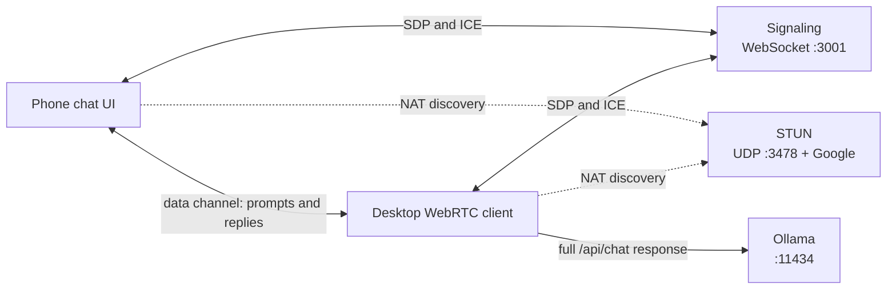
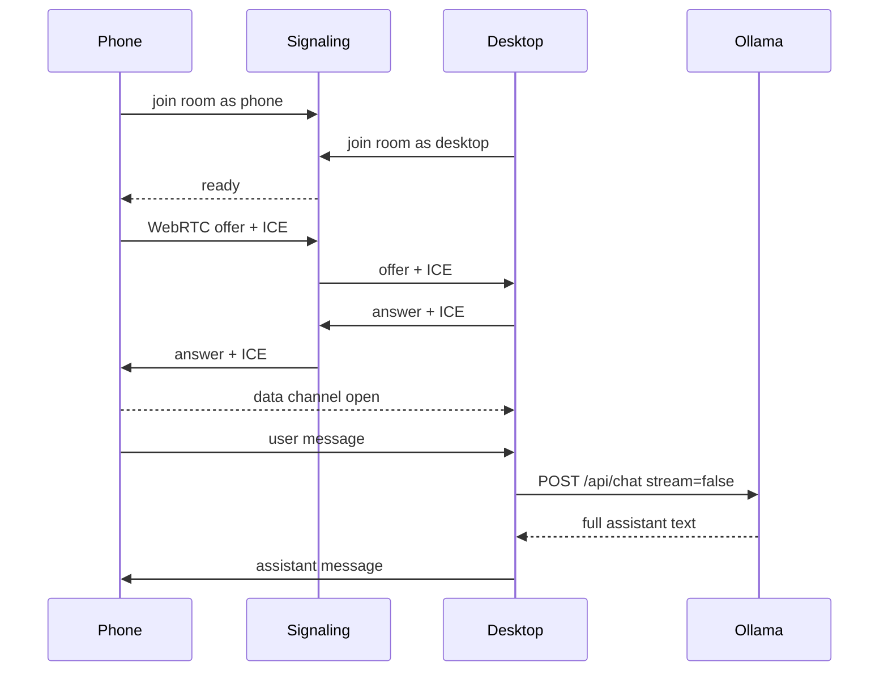

# TunLLM

TunLLM is a WebRTC tunnel from your phone to an Ollama instance running on your desktop. You type on the phone, the desktop talks to the local model, and the full reply comes back over a peer-to-peer data channel.

It is a small TypeScript stack: a phone chat UI, a desktop WebRTC client next to Ollama, a signaling server, and a STUN server.

## The problem

Ollama is bound to the machine it runs on. Phones cannot hit `localhost:11434` on your desktop, exposing Ollama on the LAN is awkward, and sending prompts through a cloud API defeats the point of a local model.

You want the model to stay on the desktop, and a simple chat UI on the phone, without standing up a public HTTP proxy.

## How it works

The phone and desktop open a WebRTC data channel. After a short handshake, chat messages travel peer-to-peer. Ollama never leaves the desktop.

Three pieces make that handshake possible:

- **Signaling** is a WebSocket server. It is not STUN. Peers join a room, then the phone's offer, the desktop's answer, and ICE candidates are relayed through it.
- **STUN** helps each peer discover a usable network address (Google's public STUN servers plus a local STUN process in this repo).
- **TURN** would relay traffic when a direct path fails. Google does not offer public TURN. On the same Wi-Fi, host candidates are usually enough.



Connection setup, then a chat turn:



The desktop keeps conversation history in memory for that session and sends complete replies, not tokens. If `OLLAMA_MODEL` is unset, it picks the smallest installed chat model and skips embedding/docling models.

## Use it

**Needs**

- Node.js 18+
- [pnpm](https://pnpm.io)
- [Ollama](https://ollama.com) running locally, with at least one chat model pulled

**Start**

```bash
pnpm install
ollama serve
pnpm dev
```

`pnpm dev` runs STUN, signaling, the desktop client, and the Vite phone app together.

Open `http://localhost:5173` on this machine. On a phone, use the Network URL Vite prints (same Wi-Fi), for example `http://192.168.1.73:5173`. The app talks to signaling on that hostname at port `3001`.

Wait until the badge says **Live**, then send a message.

**Pieces you can run alone**

| Command | Process |
|---|---|
| `pnpm stun` | STUN on UDP `3478` |
| `pnpm signaling` | signaling WebSocket on `3001` |
| `pnpm desktop` | desktop client (waits for signaling, then Ollama) |
| `pnpm app` | phone UI |

**Useful env vars**

| Variable | Default | Used by |
|---|---|---|
| `OLLAMA_URL` | `http://127.0.0.1:11434` | desktop |
| `OLLAMA_MODEL` | smallest local chat model | desktop |
| `SIGNALING_URL` | `ws://127.0.0.1:3001/ws` | desktop |
| `ROOM` | `tunllm` | desktop |
| `STUN_URL` | `stun:127.0.0.1:3478` | desktop |
| `SIGNALING_PORT` | `3001` | signaling |
| `STUN_PORT` | `3478` | stun |
| `VITE_SIGNALING_PORT` | `3001` | phone app |

Example:

```bash
OLLAMA_MODEL=granite4:micro-h pnpm desktop
```

**Layout**

- `stun.ts` — STUN binding server
- `signaling.ts` — room join and SDP/ICE relay
- `desktop.ts` — WebRTC client that calls Ollama
- `app/` — React + shadcn chat UI
